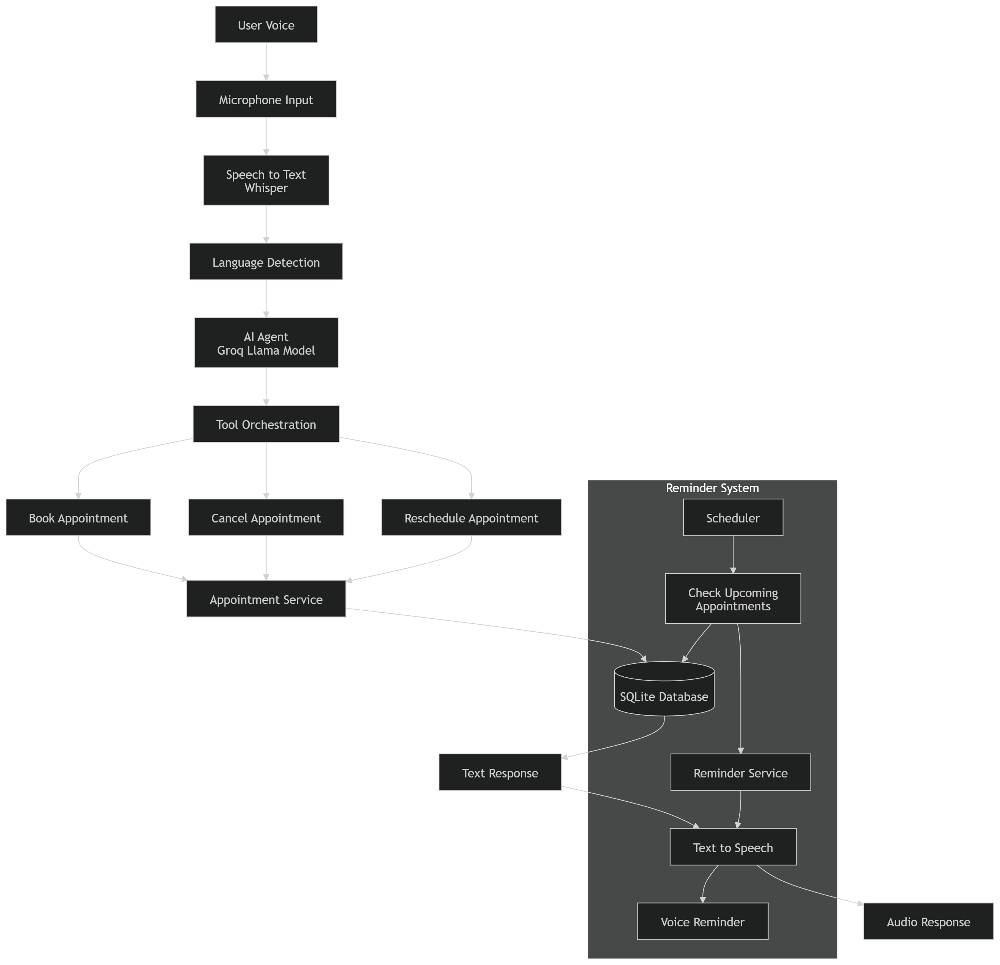

# Voice AI Hospital Appointment Agent

## Overview

This project implements a **Voice-based AI Agent** that allows patients to **book, cancel, and reschedule hospital appointments through natural voice conversations**.

The system integrates **speech recognition, AI reasoning, appointment tools, memory management, and reminder services** to automate clinical appointment workflows.

The architecture demonstrates a **modular real-time voice AI pipeline** designed for conversational healthcare applications.

---

## Features

* Voice conversation interface
* AI-driven appointment booking
* Appointment cancellation
* Appointment rescheduling
* Conflict detection for double bookings
* Multilingual detection (English / Hindi / Tamil)
* Conversation memory
* Reminder scheduler for upcoming appointments
* Outbound reminder campaign
* Latency measurement
* FastAPI backend API

---

## System Architecture



The system processes voice requests through multiple stages:

Voice Input
↓
Speech-to-Text (Whisper)
↓
AI Agent (LLM reasoning)
↓
Tool Execution (Appointment Tools)
↓
SQLite Database
↓
Reminder Scheduler / Campaign System
↓
Text-to-Speech
↓
Voice Response

### Architecture Diagram


---

## Project Structure

```id="qk0nyb"
Voice-AI-Agent

agent/
    voice_agent.py

backend/
    server.py

campaign/
    reminder_campaign.py

scheduler/
    reminder_service.py

database/
    db.py
    init_db.py

memory/
    conversation_memory.py

tools/
    appointment_tools.py

voice/
    microphone_input.py
    speech_to_text.py
    text_to_speech.py
    test_voice_agent.py

run_reminder.py
requirements.txt
README.md
```

---

## Installation

Install required dependencies:

```id="hkj9fa"
pip install -r requirements.txt
```

---

## Run Voice Agent

Start the voice AI agent:

```id="ymszz6"
python voice/test_voice_agent.py
```

Example voice command:

```id="d5mkk9"
Book cardiologist tomorrow at 10 for Imran
```

---

## Run API Server

Start the backend API:

```id="c5rbg1"
uvicorn backend.server:app --reload
```

Open API documentation:

```id="iha50r"
http://127.0.0.1:8000/docs
```

---

## Reminder System

The project includes two reminder mechanisms.

### 1. Reminder Scheduler

Automatically checks upcoming appointments and sends reminders.

Run:

```id="qey3fd"
python run_reminder.py
```

The scheduler scans the database and notifies patients about upcoming appointments.

---

### 2. Outbound Reminder Campaign

Simulates outbound reminder calls to patients with appointments scheduled for the next day.

Run:

```id="ib2ix9"
python campaign/reminder_campaign.py
```

---

## Technologies Used

* Python
* FastAPI
* Whisper (Speech Recognition)
* Groq / LLM Agent
* SQLite
* Text-to-Speech (pyttsx3)
* LangDetect

---

## Latency Measurement

The system measures latency across different stages:

* Speech-to-Text
* AI reasoning
* Text-to-Speech

Example output:

```id="tqg32d"
Latency Breakdown
STT: 4.2 seconds
Agent: 0.3 seconds
TTS: 2.5 seconds
Total: ~7 seconds
```

---

## Assignment Coverage

This implementation covers the major requirements of the assignment:

* Voice conversation agent
* Appointment lifecycle management
* Conflict detection
* Multilingual interaction
* Contextual memory
* Reminder scheduler
* Outbound reminder campaigns
* Latency measurement

---

## Author

**Mohammad Imtiyaz Khan**
